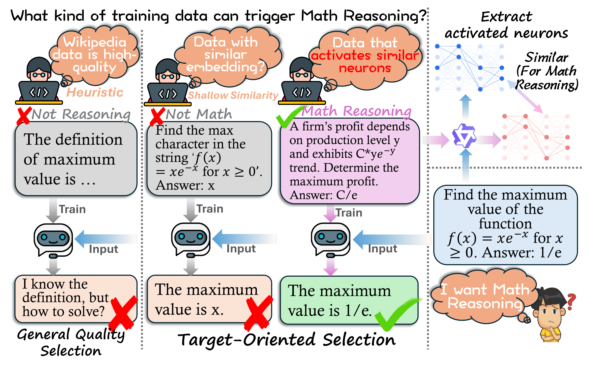
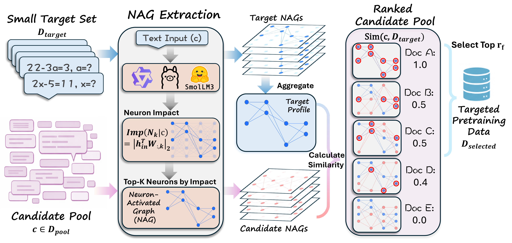

<div align="center">

# NAG

### Official implementation of *Target-Oriented Pretraining Data Selection via Neuron-Activated Graph*

<br/>

<p>
  <a href="https://arxiv.org/abs/2604.15706"></a>
  <a href="https://asillycat.github.io/NAG-website/"></a>
  <a href="LICENSE"></a>
  
  
  
</p>

[Zijun Wang](https://asillycat.github.io/)<sup>1,2</sup>, [Haoqin Tu](https://www.haqtu.me/)<sup>2</sup>, Weidong Zhou<sup>1</sup>, Yiyang Zhou<sup>3</sup>, Xiaohuan Zhou<sup>1</sup>, Bingni Zhang<sup>1</sup>, Weiguo Feng<sup>1</sup>, Taifeng Wang<sup>1</sup>, [Cihang Xie](https://cihangxie.github.io/)<sup>2</sup>, [Fengze Liu](https://scholar.google.com/citations?user=T3EjsaAAAAAJ&hl=en)<sup>1</sup>

<sup>1</sup>ByteDance &nbsp; <sup>2</sup>UC Santa Cruz &nbsp; <sup>3</sup>UNC-Chapel Hill

[Introduction](#introduction) | [Pipeline](#pipeline) | [Structure](#structure) | [Install](#install) | [Quick Start](#quick-start) | [Full Pipeline](#full-pipeline) | [Evaluation](#evaluation) | [Citation](#citation)

</div>

---

## Introduction

<p align="center">
  
</p>

**NAG-based Ranking** is a training-free, interpretable framework for target-oriented pretraining data selection. Rather than relying on black-box embeddings, NAG directly characterizes each input by the sparse set of high-impact neurons it activates in an off-the-shelf LLM.

- **How it works.** For every document, we quantify neuron impact at each transformer layer and record the top-K most influential neuron indices — forming a compact *Neuron-Activated Graph (NAG)*. Candidate data is then ranked by NAG similarity to a small set of target examples.
- **Strong results.** NAG-based Ranking improves target-oriented pretraining by **+4.9%** on average over random sampling and outperforms state-of-the-art baselines by **+5.3%** accuracy on HellaSwag.
- **Interpretable.** Deactivating just 0.12% of NAG-selected neurons triggers a 23.5% performance collapse, confirming NAG captures a sparse "functional backbone" for learning target features.

---

## Pipeline

<p align="center">
  
</p>

1. **Extract** — Run the target set and candidate pool through a frozen backbone LLM (Qwen3 / Llama 3.2 / SmolLM3). For each document, record the indices of the top-K most impactful `up_proj` neurons per layer.
2. **Rank** — Aggregate target NAGs into a per-layer neuron-activation profile, score each pool document by NAG similarity, and select the top `r_f` fraction by token budget.

---

## Structure

```
NAG/
├── nag/
│   ├── extraction/          # Stage 1: extract NAG features from documents
│   │   ├── extract.py       # main extraction script (multi-GPU via accelerate)
│   │   ├── data_collator.py # tokenization and batching
│   │   └── utils.py         # to_bln, topk_indices helpers
│   ├── ranking/             # Stage 2: rank pool against target
│   │   ├── nag_similarity.py     # core numpy kernel (Sec 2.3)
│   │   ├── rank.py               # single-target selection CLI
│   │   ├── rank_with_quality.py  # NAG + external quality signal (Sec 3.6)
│   │   ├── merge_multitarget.py  # multi-target mixture (Sec 3.5)
│   │   └── slice_layers.py       # layer subset for ablation (Sec 4.2.2)
│   ├── analysis/            # Paper analysis experiments
│   │   ├── deactivation.py  # neuron deactivation keys + patching (Sec 4.1.1)
│   │   └── tsne.py          # t-SNE visualization (Sec 4.1.2)
│   └── models/              # HuggingFace models with NAG hooks
│       ├── modeling_qwen3.py
│       ├── modeling_llama.py
│       └── modeling_smollm3.py
├── scripts/                 # Shell wrappers for the full pipeline
├── examples/
│   ├── demo.ipynb           # End-to-end notebook with real outputs
│   ├── demo_minimal.py      # CPU-only smoke test (no model needed)
│   └── make_sample_data.py  # Generate toy target + pool parquet
└── assets/                  # Figures for README
```

---

## Install

```bash
git clone https://github.com/asillycat/NAG.git
cd NAG
pip install -e .
# for t-SNE visualization (optional):
pip install -e ".[analysis]"
```

### Tested environment

| Package | Version |
| --- | --- |
| Python | 3.9+ |
| torch | 2.6.0 |
| transformers | 4.56.1 |
| accelerate | 0.30+ |

> The modified modeling files depend on internal HuggingFace APIs that changed in `transformers>=5.0`, so we pin `transformers<5.0`.

---

## Quick start

**No GPU required — similarity kernel only:**

```bash
python examples/demo_minimal.py
```

**End-to-end demo (downloads Qwen3-0.6B-Base on first run, ~1.2 GB):**

Open [`examples/demo.ipynb`](examples/demo.ipynb) — extracts NAG features and ranks a 20-document pool against a 5-document science/arithmetic-reasoning target. The committed outputs show:

| Category | Mean NAG distance |
| --- | ---: |
| science | 0.315 |
| news | 0.343 |
| narrative | 0.356 |
| code | 0.400 |

Science documents cluster at the bottom (= closest to target), confirming NAG captures task-relevant neuron patterns even at toy scale. Non-interactive shell version: `bash examples/demo_extract_and_rank.sh`.

---

## Full pipeline

### 1. Prepare inputs

Both the target set and the candidate pool should be parquet shards with one record per document:

- `--format web` (default): `{"docid": str, "doc": str, "token_num": int, "dataset": str, ...}`
- `--format final`: `{"meta": {"docid": str, ...}, "content_split": str}`

### 2. Extract NAG features

```bash
accelerate launch --num_processes 8 \
    -m nag.extraction.extract \
    --model_type qwen3-1.7b-base \
    --model_path Qwen/Qwen3-1.7B-Base \
    --in_data_path ./data/pool \
    --out_data_path ./outputs/nag_features/qwen3-1.7b-base/pool \
    --format web --max_length 120 --batch_size 8 \
    --top_k 20 --neuron_types fwd_up
```

Supported backbones:

| `--model_type` | Backbone | Layers |
| --- | --- | ---: |
| `qwen3-0.6b-base` / `qwen3-1.7b-base` / `qwen3-4b-base` / `qwen3-8b-base` | Qwen3 | 28 / 28 / 36 / 36 |
| `llama3.2-3b` | Llama 3.2 | 28 |
| `smollm3-3b-base` | SmolLM3 | 36 |

`--neuron_types` accepts any comma-separated subset of `fwd_up, fwd_down, att_q, att_k, att_v, att_o` (paper default: `fwd_up`, see §4.2.1).

### 3. Single-target ranking

Extraction outputs contain only `{docid, feature}`. The ranker joins these with the original payload (which carries `token_num`, `doc`, etc.) on `docid`:

```bash
python -m nag.ranking.rank \
    --target_features "./outputs/nag_features/qwen3-1.7b-base/target/*.jsonl" \
    --target_payload  "./data/target/*.parquet" \
    --pool_features   "./outputs/nag_features/qwen3-1.7b-base/pool/*.jsonl" \
    --pool_payload    "./data/pool/*.parquet" \
    --output_path ./outputs/selected/hellaswag.parquet \
    --feature_col fwd_up_feature \
    --num_layers 28 --top_k 20 --fraction 0.2 \
    --target_filter hellaswag_train
```

`--target_filter` keeps only target rows where the `dataset` column equals the given value (e.g. `hellaswag_train`), so you can store all benchmark splits in a single parquet and select per run. Output is a parquet of the selected pool rows with an added `nag_distance` column.

### 4. Multi-target mixture (§3.5)

Run step 3 once per target with `--fraction 0.0333` (= `r_f / 6`), then merge:

```bash
python -m nag.ranking.merge_multitarget \
    --input_paths ./outputs/selected/{arc_c,hellaswag,mmlu,triviaqa,xwinograd,xstorycloze}.parquet \
    --output_path ./outputs/selected/multi_target.parquet
```

### 5. Combine with quality signal (§3.6)

NAG distance can be combined with an existing quality score (e.g. FineWeb-Edu classifier) by min-max normalizing both signals and summing them:

```bash
python -m nag.ranking.rank_with_quality \
    --target_features "./outputs/nag_features/qwen3-1.7b-base/target/*.jsonl" \
    --target_payload  "./data/target/*.parquet" \
    --pool_features   "./outputs/nag_features/qwen3-1.7b-base/pool/*.jsonl" \
    --pool_payload    "./data/pool/*.parquet" \
    --output_path ./outputs/selected/hellaswag_plus_fwedu.parquet \
    --feature_col fwd_up_feature --num_layers 28 --top_k 20 --fraction 0.2 \
    --quality_col finewebedu_score --invert_quality \
    --target_filter hellaswag_train
```

`--invert_quality`: set when your quality column is higher-is-better (e.g. FineWeb-Edu probability), so it is converted to `1 - normalized_score` before summation.

> **Scaling.** The pandas-backed ranker handles pools up to tens of millions of documents. For the 150B-token RefinedWeb pool used in the paper, the core similarity kernel (`nag.ranking.nag_similarity`) is pure numpy with no global state — wrap it in a PySpark / Ray / Dask UDF for distributed ranking.

---

## Evaluation

All reported numbers come from [`lm-evaluation-harness`](https://github.com/EleutherAI/lm-evaluation-harness) with default prompting templates:

| Benchmark | lm-eval task | Shots | Metric |
| --- | --- | ---: | --- |
| ARC-Challenge | `arc_challenge` | 25 | `acc_norm` |
| HellaSwag | `hellaswag` | 10 | `acc_norm` |
| MMLU | `mmlu` | 5 | `acc_norm` |
| TriviaQA | `triviaqa` | 5 | `exact_match` |
| XStoryCloze (en) | `xstorycloze_en` | 0 | `acc` |
| XWinograd (en) | `xwinograd_en` | 5 | `acc` |

```bash
pip install lm-eval
lm_eval --model hf \
    --model_args pretrained=path/to/model,dtype=bfloat16 \
    --tasks arc_challenge,hellaswag,mmlu,triviaqa,xstorycloze_en,xwinograd_en \
    --num_fewshot 5 --batch_size auto \
    --output_path ./outputs/eval_results
```

> `--num_fewshot` is global; to match the paper exactly, run each benchmark separately with the shot count from the table above.

<details>
<summary><b>Neuron deactivation analysis (§4.1.1)</b></summary>

```bash
# Build deactivation keys from target NAG features.
python -m nag.analysis.deactivation build \
    --target_features "./outputs/nag_features/qwen3-1.7b-base/target/*.jsonl" \
    --target_payload  "./data/target/*.parquet" \
    --out ./outputs/deact_keys/hellaswag_k20.json \
    --num_layers 28 --top_k_extraction 20 \
    --target_filter hellaswag_train
```

```python
# In your evaluation script:
from transformers import AutoModelForCausalLM
from nag.analysis.deactivation import apply_deactivation, load_keys

model = AutoModelForCausalLM.from_pretrained("Qwen/Qwen3-1.7B-Base")
n = apply_deactivation(model, load_keys("outputs/deact_keys/hellaswag_k20.json"))
print(f"deactivated {n} neurons")  # pass `model` to lm-eval-harness
```
</details>

<details>
<summary><b>t-SNE visualization (§4.1.2)</b></summary>

```bash
python -m nag.analysis.tsne \
    --parquet ./outputs/nag_features/qwen3-1.7b-base/target_joined.parquet \
    --feature_col fwd_up_feature --num_layers 28 --top_k 20 \
    --target_datasets arc_c_train hellaswag_train mmlu_validation \
        triviaqa_train xstorycloze_train xwinograd_test \
    --per_dataset 1000 --use_pca --standardize --out tsne_dataset.png
```
</details>

---

## Citation

```bibtex
@misc{wang2026targetorientedpretrainingdataselection,
      title={Target-Oriented Pretraining Data Selection via Neuron-Activated Graph},
      author={Zijun Wang and Haoqin Tu and Weidong Zhou and Yiyang Zhou and Xiaohuan Zhou and Bingni Zhang and Weiguo Feng and Taifeng Wang and Cihang Xie and Fengze Liu},
      year={2026},
      eprint={2604.15706},
      archivePrefix={arXiv},
      primaryClass={cs.CL},
      url={https://arxiv.org/abs/2604.15706},
}
```

---

## License

Apache License 2.0. See [LICENSE](LICENSE).
